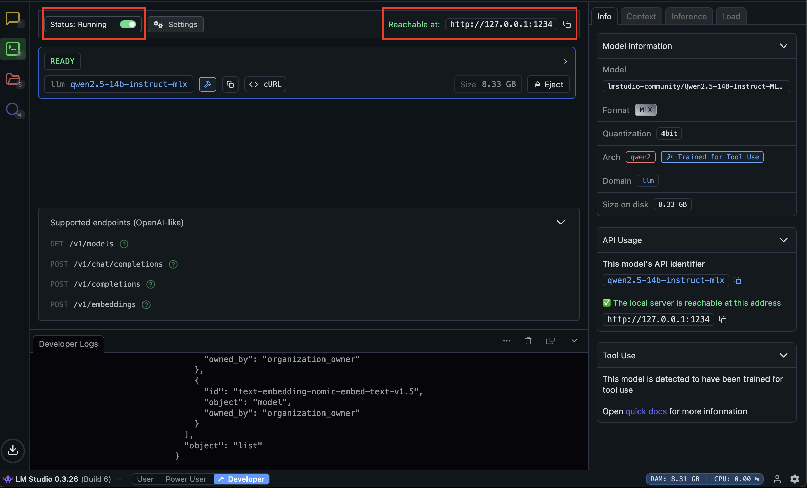
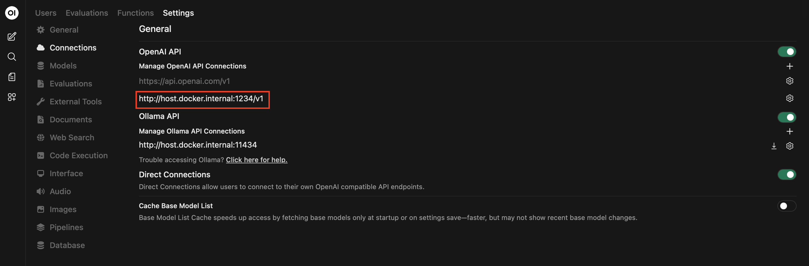
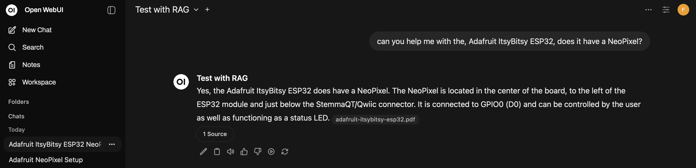
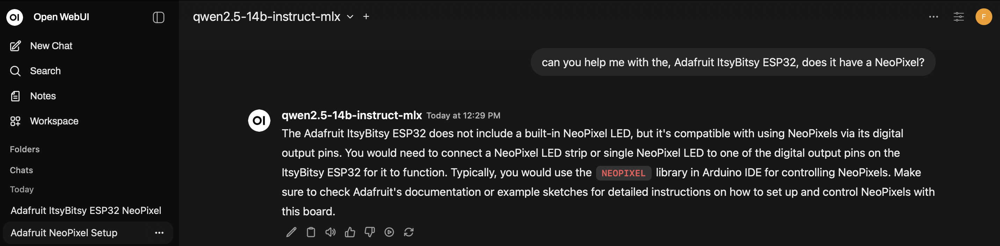

Follow this halfbad documentation or be better and set it up based on the real docs: https://docs.openwebui.com/features/rag/
What I wanted to test is under the header  `Add "static" RAG -> Prompt`
# Easy POC setup without RAG
1. Start LM studio, download an appropriate model for your setup (if running on your laptop, pick a small one so you actually can test without getting bogged down), I used: qwen2.5-14b-instruct-mlx
2. Start the server in LM studio

3. Run `docker compose up`
4. In admin panel connect to your LM studio instance, example: http://host.docker.internal:1234/v1 

5. Chat away with your local LLM through open web ui

# Add "static" RAG
1. Create a workspace in open web ui
2. Add your model
3. Upload some document, I used: https://cdn-learn.adafruit.com/downloads/pdf/adafruit-itsybitsy-esp32.pdf
## Prompt
Ask something using the workspace that can be answered by the document uploaded
Example: 
This is a correct answer.
### Promp outside workspace:

This is a incorrect answer.

# Next step exploration
## Integration 
What if - it would be possible to use existing knowledge base to get valueble context for users in their daily work. Using amazing existing search engines. 

### Questions
- How well would it perform 
#### Further questions 
- Where would this integration live in the architecture 
- How can the integration be packaged 